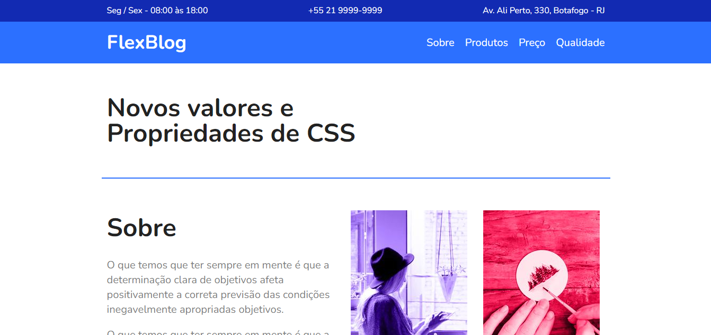

# FlexBlog

## Conteúdo
- [Sobre](#sobre)
- [Link](#link)
- [Tecnologias](#tecnologias)
- [Autor](#autor)

## Sobre
Projeto criado durante o curso de Flexbox da Origamid para melhorar e entender os conceitos.

## Link
- Site - https://flexblog-sanches.netlify.app

## Tecnologias
- HTML
- CSS

## Autor
- Site - https://sanches-spoladore.netlify.app